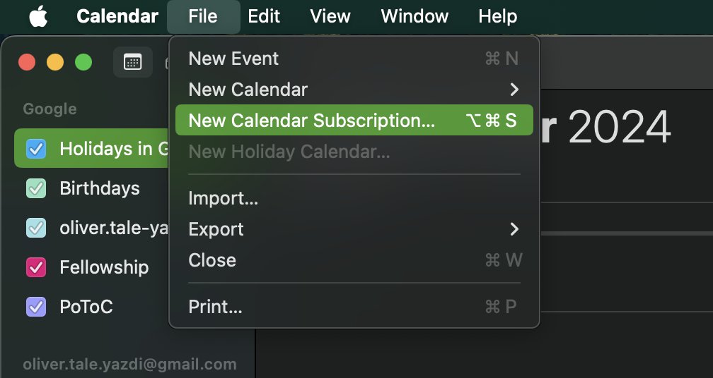

  # Release Registry

  Single source of truth regarding past and future releases of the Polkadot SDK.

  This repo contains a [JSON schema](./releases-v1.schema.json) as schema for the [releases.json](./releases-v1.json) file that tracks all SDK releases. The schema and releases file are suffixed with `v1` in case we ever do a breaking change to the format, then the old format can still be supported.

  ## Calendar

<!-- DO NOT EDIT. Run `python3 update-readme.py` instead. -->

<!-- TEMPLATE BEGIN -->

| Version | Cutoff | Published | End of Life | State |
|---------|--------|-----------|-------------|-------|
| **[stable2407](https://github.com/paritytech/polkadot-sdk/releases/tag/polkadot-stable2407)** | 2024-04-29 | 2024-04-29 | 2025-04-29 | Released |
| &nbsp;&nbsp;[stable2407-1](https://github.com/paritytech/polkadot-sdk/releases/tag/polkadot-stable2407-1) | 2024-08-14 | 2024-08-15 |  | Released |
| &nbsp;&nbsp;stable2407-2 | 2024-08-28 | ~2024-09-02 |  | Planned |
| &nbsp;&nbsp;stable2407-3 | ~2024-09-11 | ~2024-09-16 |  | Planned |
| **stable2409** | ~2024-09-02 | ~2024-09-25 | ~2025-09-25 | Planned |
| &nbsp;&nbsp;stable2409-1 | ~2024-10-09 | ~2024-10-12 |  | Planned |
| &nbsp;&nbsp;stable2409-2 | ~2024-10-23 | ~2024-10-26 |  | Planned |
| &nbsp;&nbsp;stable2409-3 | ~2024-11-06 | ~2024-11-09 |  | Planned |
| &nbsp;&nbsp;stable2409-4 | ~2024-11-20 | ~2024-11-23 |  | Planned |
| &nbsp;&nbsp;stable2409-5 | ~2024-12-04 | ~2024-12-07 |  | Planned |
| &nbsp;&nbsp;stable2409-6 | ~2024-12-18 | ~2024-12-21 |  | Planned |
| &nbsp;&nbsp;stable2409-7 | ~2025-01-01 | ~2025-01-04 |  | Planned |
| &nbsp;&nbsp;stable2409-8 | ~2025-01-15 | ~2025-01-18 |  | Planned |
| &nbsp;&nbsp;stable2409-9 | ~2025-01-29 | ~2025-02-01 |  | Planned |
| &nbsp;&nbsp;stable2409-10 | ~2025-02-12 | ~2025-02-15 |  | Planned |
| &nbsp;&nbsp;stable2409-11 | ~2025-02-26 | ~2025-03-01 |  | Planned |
| &nbsp;&nbsp;stable2409-12 | ~2025-03-12 | ~2025-03-15 |  | Planned |
| &nbsp;&nbsp;stable2409-13 | ~2025-03-26 | ~2025-03-29 |  | Planned |
| &nbsp;&nbsp;stable2409-14 | ~2025-04-09 | ~2025-04-12 |  | Planned |
| &nbsp;&nbsp;stable2409-15 | ~2025-04-23 | ~2025-04-26 |  | Planned |
| &nbsp;&nbsp;stable2409-16 | ~2025-05-07 | ~2025-05-10 |  | Planned |
| &nbsp;&nbsp;stable2409-17 | ~2025-05-21 | ~2025-05-24 |  | Planned |
| &nbsp;&nbsp;stable2409-18 | ~2025-06-04 | ~2025-06-07 |  | Planned |
| &nbsp;&nbsp;stable2409-19 | ~2025-06-18 | ~2025-06-21 |  | Planned |
| &nbsp;&nbsp;stable2409-20 | ~2025-07-02 | ~2025-07-05 |  | Planned |
| &nbsp;&nbsp;stable2409-21 | ~2025-07-16 | ~2025-07-19 |  | Planned |
| &nbsp;&nbsp;stable2409-22 | ~2025-07-30 | ~2025-08-02 |  | Planned |
| &nbsp;&nbsp;stable2409-23 | ~2025-08-13 | ~2025-08-16 |  | Planned |
| &nbsp;&nbsp;stable2409-24 | ~2025-08-27 | ~2025-08-30 |  | Planned |
| &nbsp;&nbsp;stable2409-25 | ~2025-09-10 | ~2025-09-13 |  | Planned |
| &nbsp;&nbsp;stable2409-26 | ~2025-09-24 | ~2025-09-27 |  | Planned |
| **stable2501** | ~2025-01-01 | ~2025-02-15 | ~2026-02-15 | Planned |
| &nbsp;&nbsp;stable2501-1 | ~2025-03-01 | ~2025-03-04 |  | Planned |
| &nbsp;&nbsp;stable2501-2 | ~2025-03-15 | ~2025-03-18 |  | Planned |
| &nbsp;&nbsp;stable2501-3 | ~2025-03-29 | ~2025-04-01 |  | Planned |
| &nbsp;&nbsp;stable2501-4 | ~2025-04-12 | ~2025-04-15 |  | Planned |
| &nbsp;&nbsp;stable2501-5 | ~2025-04-26 | ~2025-04-29 |  | Planned |
| &nbsp;&nbsp;stable2501-6 | ~2025-05-10 | ~2025-05-13 |  | Planned |
| &nbsp;&nbsp;stable2501-7 | ~2025-05-24 | ~2025-05-27 |  | Planned |
| &nbsp;&nbsp;stable2501-8 | ~2025-06-07 | ~2025-06-10 |  | Planned |
| &nbsp;&nbsp;stable2501-9 | ~2025-06-21 | ~2025-06-24 |  | Planned |
| &nbsp;&nbsp;stable2501-10 | ~2025-07-05 | ~2025-07-08 |  | Planned |
| &nbsp;&nbsp;stable2501-11 | ~2025-07-19 | ~2025-07-22 |  | Planned |
| &nbsp;&nbsp;stable2501-12 | ~2025-08-02 | ~2025-08-05 |  | Planned |
| &nbsp;&nbsp;stable2501-13 | ~2025-08-16 | ~2025-08-19 |  | Planned |
| &nbsp;&nbsp;stable2501-14 | ~2025-08-30 | ~2025-09-02 |  | Planned |
| &nbsp;&nbsp;stable2501-15 | ~2025-09-13 | ~2025-09-16 |  | Planned |
| &nbsp;&nbsp;stable2501-16 | ~2025-09-27 | ~2025-09-30 |  | Planned |
| &nbsp;&nbsp;stable2501-17 | ~2025-10-11 | ~2025-10-14 |  | Planned |
| &nbsp;&nbsp;stable2501-18 | ~2025-10-25 | ~2025-10-28 |  | Planned |
| &nbsp;&nbsp;stable2501-19 | ~2025-11-08 | ~2025-11-11 |  | Planned |
| &nbsp;&nbsp;stable2501-20 | ~2025-11-22 | ~2025-11-25 |  | Planned |
| &nbsp;&nbsp;stable2501-21 | ~2025-12-06 | ~2025-12-09 |  | Planned |
| &nbsp;&nbsp;stable2501-22 | ~2025-12-20 | ~2025-12-23 |  | Planned |
| &nbsp;&nbsp;stable2501-23 | ~2026-01-03 | ~2026-01-06 |  | Planned |
| &nbsp;&nbsp;stable2501-24 | ~2026-01-17 | ~2026-01-20 |  | Planned |
| &nbsp;&nbsp;stable2501-25 | ~2026-01-31 | ~2026-02-03 |  | Planned |
| &nbsp;&nbsp;stable2501-26 | ~2026-02-14 | ~2026-02-17 |  | Planned |

<!-- TEMPLATE END -->

Dates with a `~` prefix are estimates.

### Subscribe

Subscribe to the calendar by adding this iCal link to your Google or Apple calendar:

`https://raw.githubusercontent.com/paritytech/release-registry/main/releases-v1.ics`

 Google has the "From URL" option and Apple "New Calendar Subscription" option for this:

<!-- two pics next to each other -->

 Google            |  Apple
:-------------------------:|:-------------------------:
  |  

## Automation

Two scripts are currently in place to:

- [update-readme.py](./update-readme.py) - updates the README.md file with the data from the releases.json file
- [update-calendar.py](./update-calendar.py) - generates an iCal file from the releases.json file

## Roadmap

  - [x] Double check dates and make the repo public
  - [ ] Sync with other teams on how to incooperate this
    - [ ] Release Engineering
    - [ ] Security
    - [ ] DevOps
    - [ ] Marketing
    - [ ] CEX Comms
    - [ ] Fellowship Secretary
  - [ ] Setup Gh pages with calendar
  - [ ] Setup automation to keep data in sync
  - [ ] Setup feed to subscribe on changes
