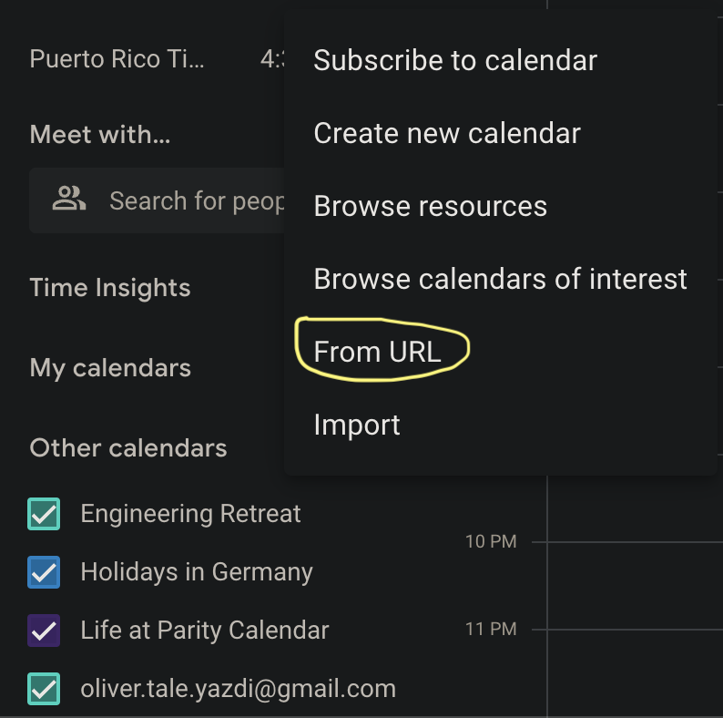

  # Release Registry

  Single source of truth regarding past and future releases of the Polkadot SDK.

  This repo contains a [JSON schema](./releases-v1.schema.json) as schema for the [releases.json](./releases-v1.json) file that tracks all SDK releases. The schema and releases file are suffixed with `v1` in case we ever do a breaking change to the format, then the old format can still be supported.

  ## Calendar

<!-- DO NOT EDIT. Run `python3 update-readme.py` instead. -->

<!-- TEMPLATE BEGIN -->

| Version | Cutoff | Published | End of Life | State |
|---------|--------|-----------|-------------|-------|
| **[stable2407](https://github.com/paritytech/polkadot-sdk/releases/tag/polkadot-stable2407)** | 2024-04-29 | 2024-04-29 | 2025-04-29 | Released |
| &nbsp;&nbsp;[stable2407-1](https://github.com/paritytech/polkadot-sdk/releases/tag/polkadot-stable2407-1) | 2024-08-14 | 2024-08-15 |  | Released |
| &nbsp;&nbsp;stable2407-2 | 2024-08-28 | ~2024-09-02 |  | Planned |
| &nbsp;&nbsp;stable2407-3 | ~2024-09-11 | ~2024-09-16 |  | Planned |
| **stable2410** | ~2024-09-02 | ~2024-09-25 | ~2025-09-25 | Planned |

<!-- TEMPLATE END -->

Dates with a `~` prefix are estimates.

### Subscribe

Subscribe to the calendar by adding this iCal link to your Google or Apple calendar:

`https://raw.githubusercontent.com/paritytech/release-registry/main/releases-v1.ics`

 Google has the "From URL" option and Apple "New Calendar Subscription" option for this:

<!-- two pics next to each other -->

 Google            |  Apple
:-------------------------:|:-------------------------:
  |  

## Automation

Two scripts are currently in place to:

- [update-readme.py](./update-readme.py) - updates the README.md file with the data from the releases.json file
- [update-calendar.py](./update-calendar.py) - generates an iCal file from the releases.json file

## Roadmap

  - [x] Double check dates and make the repo public
  - [ ] Sync with other teams on how to incooperate this
    - [ ] Release Engineering
    - [ ] Security
    - [ ] DevOps
    - [ ] Marketing
    - [ ] CEX Comms
    - [ ] Fellowship Secretary
  - [ ] Setup Gh pages with calendar
  - [ ] Setup automation to keep data in sync
  - [ ] Setup feed to subscribe on changes
