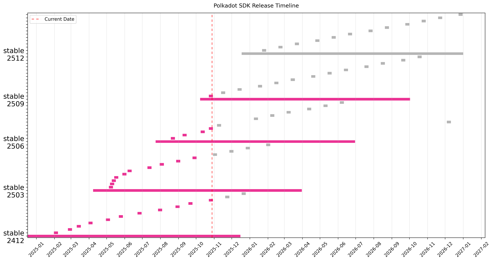
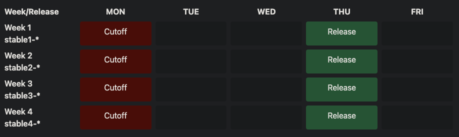

# Release Registry

[](#)&nbsp;&nbsp;[](#)

Single source of truth regarding past and future releases of the Polkadot SDK.

This repo contains a [releases-v1.json](./releases-v1.json) file that tracks all SDK releases and a [JSON schema](./releases-v1.schema.json) to ensure that it is in canonical format.

This Gantt chart shows the released (pink) and planned (grey) releases. The longer bars are the stable releases and the small ones are the patches on top of it.



## Calendar

Planned and historic release dates:

<!-- DO NOT EDIT. Run `python3 update-readme.py` instead. -->

<!-- TEMPLATE BEGIN -->

| Version | Cutoff | Publish | End of Life | State |
|---------|--------|-----------|-------------|-------|
| **stable2407** | 2024-04-29 | 2024-04-29 | 2025-04-29 | [Released](https://github.com/paritytech/polkadot-sdk/releases/tag/polkadot-stable2407) |
| &nbsp;&nbsp;stable2407-6 | 2025-01-21 | 2025-01-21 |  | [Released](https://github.com/paritytech/polkadot-sdk/releases/tag/polkadot-stable2407-6) |
| &nbsp;&nbsp;stable2407-7 | 2025-02-06 | 2025-02-06 |  | [Released](https://github.com/paritytech/polkadot-sdk/releases/tag/polkadot-stable2407-7) |
| &nbsp;&nbsp;stable2407-8 | 2025-03-03 | 2025-03-06 |  | Planned |
| &nbsp;&nbsp;stable2407-9 | 2025-04-07 | 2025-04-10 |  | Planned |
| &nbsp;&nbsp;[5 more past, 1 more planned](CALENDAR.md) |  |  | | |
| **stable2409** | 2024-09-02 | 2024-09-26 | 2025-09-25 | [Released](https://github.com/paritytech/polkadot-sdk/releases/tag/polkadot-stable2409) |
| &nbsp;&nbsp;stable2409-4 | 2025-01-23 | 2025-01-23 |  | [Released](https://github.com/paritytech/polkadot-sdk/releases/tag/polkadot-stable2409-4) |
| &nbsp;&nbsp;stable2409-5 | 2025-02-13 | 2025-02-13 |  | [Released](https://github.com/paritytech/polkadot-sdk/releases/tag/polkadot-stable2409-5) |
| &nbsp;&nbsp;stable2409-6 | 2025-03-10 | 2025-03-13 |  | Planned |
| &nbsp;&nbsp;stable2409-7 | 2025-04-14 | 2025-04-17 |  | Planned |
| &nbsp;&nbsp;[3 more past, 6 more planned](CALENDAR.md) |  |  | | |
| **stable2412** | 2024-11-06 | 2024-12-17 | 2025-12-16 | [Released](https://github.com/paritytech/polkadot-sdk/releases/tag/polkadot-stable2412) |
| &nbsp;&nbsp;stable2412-1 | 2025-01-29 | 2025-01-31 |  | [Released](https://github.com/paritytech/polkadot-sdk/releases/tag/polkadot-stable2412-1) |
| &nbsp;&nbsp;stable2412-2 | 2025-02-17 | 2025-02-20 |  | Planned |
| &nbsp;&nbsp;stable2412-3 | 2025-03-17 | 2025-03-20 |  | Planned |
| &nbsp;&nbsp;[9 more planned](CALENDAR.md) |  |  | | |
| **stable2503** | 2025-02-17 | 2025-03-31 | 2026-03-31 | Planned |
| &nbsp;&nbsp;stable2503-1 | 2025-04-28 | 2025-05-01 |  | Planned |
| &nbsp;&nbsp;stable2503-2 | 2025-05-26 | 2025-05-29 |  | Planned |
| &nbsp;&nbsp;[11 more planned](CALENDAR.md) |  |  | | |
| **stable2506** | 2025-05-15 | 2025-06-30 | 2026-06-30 | Planned |
| &nbsp;&nbsp;stable2506-1 | 2025-08-04 | 2025-08-07 |  | Planned |
| &nbsp;&nbsp;stable2506-2 | 2025-09-01 | 2025-09-04 |  | Planned |
| &nbsp;&nbsp;[11 more planned](CALENDAR.md) |  |  | | |

<!-- TEMPLATE END -->

### Subscribe

Subscribe to the calendar by adding this iCal link to your Google or Apple calendar:

`https://raw.githubusercontent.com/paritytech/release-registry/main/releases-v1.ics`

 Google has an "From URL" and Apple "New Calendar Subscription" option for this:

 Google            |  Apple
:-------------------------:|:-------------------------:
  |  

## Schedule

### Releases

The Polkadot SDK has a `stableYYMM` release every 3 months. Each stable release is supported for one year through a monthly patching schedule. The releases are not *exactly* 3 months apart, but we try to keep it close. The exact dates are in the calendar.  
Stable releases undergo a 1.5 month QA period before being published. This explains the difference between the `cutoff` and `published` dates.

### Patches

Patches have the tag format `stableYYMM-PATCH` where `PATCH` ranges from 1 to 99. There is no zero padding present, example: `stable2407-1` or `stable2409-10`.

The patching schedule of each stable release is assigned a week of the month. This works well, since there can be at most four stable releases maintained at once.  For example: release `stable2407` is always patched in the first week of a month. This means that on the first Monday of each month, a new patch is cut off, and on the first Thursday after that Monday, it is published.



## Goals

The two main goals of this repo are to improve:
- **Communication**: clear information about past and upcoming releases. Hoarding information inside Parity is not helpful. This repo aims to make it easier for the Polkadot Ecosystem to know what's going on. This can be helpful to all departments; developers, marketing, devops, security etc.
- **Expectations**: set clear expectations by having a public schedule. Know when what is coming.

## Maintenance

### Release Planning
(how to add a new release to the json)

First, check the calendar when about 3 months passed from the publish date of the last release. Then subtract about 1.5 months from that and call the plan command with that date:

```bash
python3 scripts/manage.py release plan stable2412 2024-11-06
```

Then figure out when the first patch date should be; you have to select a Monday for the patching schedule to be calculated (errors if not a Monday). You should select either a week that is empty and has no schedule, or the one where the oldest release is currently being patched.  
The script will then count the how many-th monday of the month it is and begin lining it up with the months like in the image above.

Example where we want the first patch to be cut off on 2024-07-29:

```bash
python3 scripts/manage.py backfill-patches stable2407 --start-date 2024-07-29
```

Then update the README to see the changes by running `just`.

### Release Cutoff / Publish

Run this command to cut off a release:

```bash
python3 scripts/manage.py release cutoff stable2407-2 2024-09-02
```

With `publish` likewise.

## Automation

Two scripts are currently in place to:

- [manage.py](./scripts/manage.py) - manage the releases json file (plan, cutoff, publish, etc)
- [update-readme.py](./scripts/update-readme.py) - updates the README.md file with the data from the releases.json file
- [update-calendar.py](./scripts/update-calendar.py) - generates an iCal file from the releases.json file
- [update-badges.py](./scripts/update-badges.py) - re-generate the badges in the `badges` folder for downstream use.
