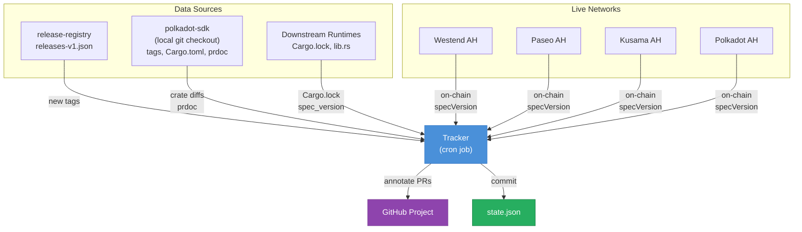
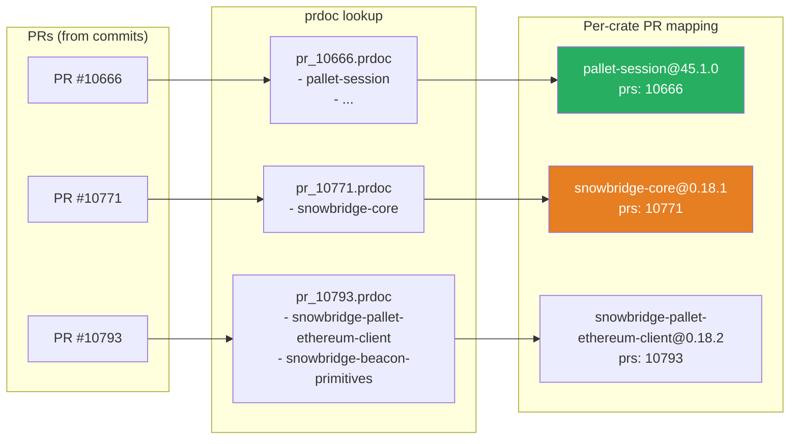
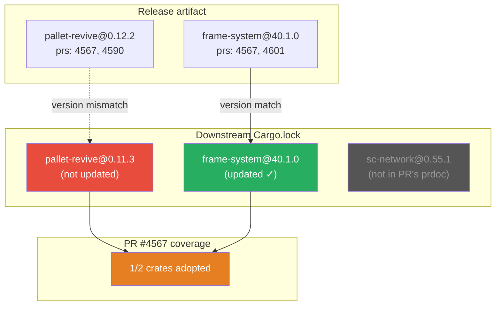
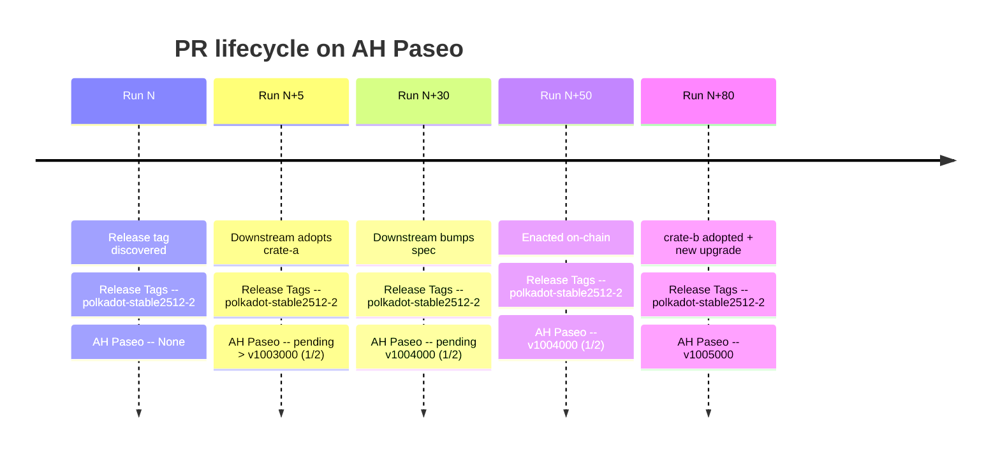

Track when polkadot-sdk PRs get deployed to specific networks.

Each PR in the GitHub Project gets annotated with the release tag and deployment spec version per network:


## Overview

A system that maps the journey of a PR from "merged in polkadot-sdk" to "live on network X",
by tracking crate version changes through the release pipeline and downstream runtime repos.

The tracker runs as a cron-based GitHub Action in the [release-registry](https://github.com/paritytech/release-registry) repo. Each run:

1. Reads [`releases-v1.json`](https://github.com/paritytech/release-registry/blob/main/releases-v1.json) in [release-registry](https://github.com/paritytech/release-registry) to discover new release tags across all supported stable branches.
2. For each new release tag, resolves contributing PRs and their crate version bumps using a local polkadot-sdk git checkout.
3. Detects when downstream runtime repos (Paseo, Fellows) pick up those crate versions.
4. Queries on-chain spec_version to determine deployment status.
5. Annotates PRs with custom fields of a GitHub Project.

All state is persisted in [`state.json`](https://github.com/paritytech/release-registry/blob/main/tracker/state.json), committed to [release-registry](https://github.com/paritytech/release-registry).



## Background: Release Process

See [RELEASE.md](https://github.com/paritytech/polkadot-sdk/blob/master/docs/RELEASE.md) for full details.

- PRs merge to `master`.
- Stable branches (`stableYYMM`) are cut from master quarterly.
- Backports cherry-pick PRs from master onto stable branches. Cherry-picks preserve the original PR number in the commit message.
- Crates are published from **all supported stable branches** (currently 2506, 2509, 2512), not just the recommended one.
- Each crate publish gets a tag (e.g. [`polkadot-stable2512-2`](https://github.com/paritytech/polkadot-sdk/tree/polkadot-stable2512-2)) recorded in [release-registry](https://github.com/paritytech/release-registry/blob/main/releases-v1.json).
- When crates are published from a stable branch, a post-release workflow moves prdoc files into versioned subdirectories (e.g. `prdoc/stable2512/`, `prdoc/stable2512-1/`). These directories on master are the authoritative record of which PRs belong to each release.
- Downstream runtime repos ([`polkadot-fellows/runtimes`](https://github.com/polkadot-fellows/runtimes), [`paseo-network/runtimes`](https://github.com/paseo-network/runtimes)) consume crates from crates.io.
- Some runtimes live inside polkadot-sdk itself (e.g. Westend Asset Hub). For these "in-repo" runtimes, every PR merged to master is already adopted, there is no separate downstream consumption step.

## Pipeline

### Step 1: Discover new releases

The discover step requires a local polkadot-sdk git checkout, specified via the `--sdk-repo` CLI flag or `POLKADOT_SDK_DIR` env var. All git operations use refs/tags directly and never modify the working tree, so it is safe to point at a checkout you are actively working in.

On each run:

- Fetch [`releases-v1.json`](https://github.com/paritytech/release-registry/blob/main/releases-v1.json) from [release-registry](https://github.com/paritytech/release-registry).
- For each non-deprecated stable branch, collect all patches with a published tag. Filter to tags published after `last_processed_tags_date` in [`state.json`](https://github.com/paritytech/release-registry/blob/main/tracker/state.json), skipping any already present in the `releases` array. After processing, set `last_processed_tags_date` to the max publish date among the processed tags.

For each new tag, the approach differs depending on whether this is the initial cut of a new stable branch or a subsequent patch:

#### New stable branch cut (e.g. `polkadot-stable2512`)

1. Read all prdoc files from `prdoc/stable2512/` on master. Each prdoc provides the PR number and affected crate names.
2. For each affected crate, read its version from the Cargo.toml at the tag (`git show polkadot-stable2512:path/to/Cargo.toml`).
3. Build the per-crate PR mapping directly from the prdocs.

This avoids the massive cross-branch diff (400+ changed Cargo.toml files) that would result from comparing against the previous branch's last tag.

#### Subsequent patch (e.g. `polkadot-stable2512-1`)

1. Find the previous tag on the same branch (`polkadot-stable2512`).
2. List changed Cargo.toml files between the two tags: `git diff --name-only polkadot-stable2512..polkadot-stable2512-1 -- */Cargo.toml`. Same-branch diffs are always small (~30 files).
3. For each changed Cargo.toml, compare versions at both tags.
4. Extract PR numbers from commit messages between the two tags: `git log polkadot-stable2512..polkadot-stable2512-1 --format=%s`. Backport commits follow the format `[stable2512] Backport #<original_PR> (#<backport_PR>)`. We extract the **original PR** number.
5. Look up prdocs (from `prdoc/stable2512-1/` on master) to map PRs to crate names.

### Step 2: Resolve PRs per crate using prdoc

For each PR contributing to the release, look up its [prdoc](https://github.com/paritytech/polkadot-sdk/tree/master/prdoc) file (`pr_<number>.prdoc`). The prdoc's `crates` array lists which crates the PR modifies. Cross-reference this with the crates that had a version bump to build a per-crate PR list.

PRs without a prdoc (CI changes, docs, release automation) are skipped. They don't produce crate version changes and can't be mapped to any crate.

The `published` timestamp for each crate is taken from the release publish date in [`releases-v1.json`](https://github.com/paritytech/release-registry/blob/main/releases-v1.json) (same for all crates in a given release).

Append a release entry to [`state.json`](https://github.com/paritytech/release-registry/blob/main/tracker/state.json).

#### Example: [polkadot-stable2512-1](https://github.com/paritytech/polkadot-sdk/tree/polkadot-stable2512-1) -> [polkadot-stable2512-2](https://github.com/paritytech/polkadot-sdk/tree/polkadot-stable2512-2)

From [`releases-v1.json`](https://github.com/paritytech/release-registry/blob/main/releases-v1.json), `stable2512-2` was published on 2026-02-23 with tag [`polkadot-stable2512-2`](https://github.com/paritytech/polkadot-sdk/tree/polkadot-stable2512-2).

Comparing the two tags via `git log` shows 29 commits, including:

```
[stable2512] Backport #10666 (#10898)
[stable2512] Backport #10925 (#10927)
[stable2512] Backport #10793 (#10899)
[stable2512] Backport #10808 (#10845)
[stable2512] Backport #10771 (#11021)
[stable2512] Post crates release activities for stable2512-2 (#11002)
...
```

Diffing Cargo.toml versions between the two tags:

| Crate | stable2512-1 | stable2512-2 |
|---|---|---|
| `pallet-session` | 45.0.0 | 45.1.0 |
| `snowbridge-core` | 0.18.0 | 0.18.1 |
| ... | ... | ... |

For each PR, the prdoc declares which crates it touches.

For example:

- [PR #10666](https://github.com/paritytech/polkadot-sdk/pull/10666)'s prdoc lists `pallet-session` (among others)
- [PR #10771](https://github.com/paritytech/polkadot-sdk/pull/10771)'s prdoc lists `snowbridge-core`
- [PR #10793](https://github.com/paritytech/polkadot-sdk/pull/10793)'s prdoc lists `snowbridge-pallet-ethereum-client` and `snowbridge-beacon-primitives`

This produces a per-crate PR mapping:

```json
{
  "tag": "polkadot-stable2512-2",
  "prev_tag": "polkadot-stable2512-1",
  "crates": [
    { "name": "pallet-session", "version": "45.1.0", "published": "2026-02-23", "prs": [10666] },
    { "name": "snowbridge-core", "version": "0.18.1", "published": "2026-02-23", "prs": [10771] },
    { "name": "snowbridge-pallet-ethereum-client", "version": "0.18.2", "published": "2026-02-23", "prs": [10793] }
  ]
}
```

This per-crate structure enables precise downstream tracking: when a downstream picks up `pallet-session@45.1.0` but not `snowbridge-core@0.18.1`, only [PR #10666](https://github.com/paritytech/polkadot-sdk/pull/10666) is considered deployed while [PR #10771](https://github.com/paritytech/polkadot-sdk/pull/10771) remains pending.



> **Note:** A PR can appear in releases from different stable branches (e.g. merged to master, then backported to stable2509 and stable2512). This is expected and correct. A PR can also appear under multiple crates within the same release if it modifies several crates.

### Step 3: Detect downstream crate consumption

For each watched downstream repo, on each run:

1. Fetch latest commit on the tracked branch. Compare against the runtime entry's `last_seen_commit` in [`state.json`](https://github.com/paritytech/release-registry/blob/main/tracker/state.json).
2. If new commits exist, fetch `Cargo.lock` and `Cargo.toml` to determine resolved crate versions and runtime dependencies.
3. Match resolved versions against release artifacts at the per-crate level to find contributing PRs.
4. For each PR, compute its deployment coverage: how many of the PR's crates (from its prdoc) are dependencies of this specific runtime, and how many of those have been updated to the release version. A crate is relevant if it appears in the runtime's `Cargo.toml` dependency tree (checked via `cargo_toml_path`). The resolved version comes from the repo-wide `Cargo.lock`. This avoids false positives from crates used by other runtimes in the same repo.

**In-repo runtimes** (e.g. Westend Asset Hub in polkadot-sdk, configured with `"in_repo": true`): skip Cargo.lock/Cargo.toml fetching and version matching entirely. Since every PR merged to master is already in the runtime's source tree, all PRs are treated as adopted. Only the `spec_version` is fetched from the source code, to feed the status state machine.

#### Example: paseo-network/runtimes and pallet-revive

- Downstream key in state: `paseo-network/runtimes:main`
- `last_seen_commit`: [`1350eff0cad9b4ec285f930139d72b6cdffaf01d`](https://github.com/paseo-network/runtimes/commit/1350eff0cad9b4ec285f930139d72b6cdffaf01d)
- New head detected: [`7c73a295ca55125d54fc07b89726feb66ce7b7c0`](https://github.com/paseo-network/runtimes/commit/7c73a295ca55125d54fc07b89726feb66ce7b7c0)
- `Cargo.lock` shows `pallet-revive` at version `0.12.2`

At this point the tracker looks up release artifacts for `(crate = pallet-revive, version = 0.12.2)` and finds the per-crate PR list. For each PR, it checks which of the PR's crates exist in the downstream Cargo.lock and whether they've been updated.

For example, if [PR #4567](https://github.com/paritytech/polkadot-sdk/pull/4567) touches `pallet-revive` and `frame-system` (per its prdoc), and the downstream Cargo.lock contains both crates but only `frame-system` was updated to the release version, the PR's coverage for this downstream is 1/2.



### Step 4: Determine expected spec_version

When a downstream repo picks up new crate versions, parse the runtime's `lib.rs` at the detected commit to extract the `spec_version` constant.

The parsed spec_version may not have been bumped yet. To detect this, compare it against the on-chain version: if they match and the on-chain upgrade predates the crate publish date, the downstream hasn't bumped the version yet. In this case the expected version is unknown, only that it will be greater than the current on-chain version.

### Step 5: Confirm on-chain deployment

Query `state_getRuntimeVersion` via RPC for each tracked network. Compare the on-chain `specVersion` against the expected spec_version from Step 4.

When a new runtime upgrade is detected (spec version increased since last run), record it in the runtime entry's `upgrades` array with the block number, block hash, and date (from the block timestamp). This upgrade history is persisted in [`state.json`](https://github.com/paritytech/release-registry/blob/main/tracker/state.json) and provides a timeline of when each spec version went live.

### Step 6: Annotate PRs in GitHub Project V2

Use the GitHub GraphQL API to add each PR to the project (if not already present) and set custom field values.

Fields per PR:

- **Release Tags** (text): all release tags that include this PR, across all stable branches (e.g. `polkadot-stable2509-6, polkadot-stable2512-2`). A PR backported to multiple branches will have multiple tags.
- **Per (runtime, network) fields** (text, e.g. "AH Paseo"):

| Status | Meaning |
|---|---|
| `<None>` | Crates not yet picked up by the downstream repo |
| `pending > v<spec_version>` | Crates adopted in downstream code, spec_version not yet bumped |
| `pending > v<spec_version> (N/M crates)` | Some crates adopted, spec_version not yet bumped |
| `pending v<spec_version>` | All crates adopted, spec_version bumped, not yet enacted on-chain |
| `pending v<spec_version> (N/M crates)` | Some crates adopted, spec_version bumped, not yet enacted |
| `v<spec_version>` | Enacted on-chain, all relevant crates adopted |
| `v<spec_version> (N/M crates)` | Enacted on-chain, only N of M relevant crates included |

Only crates that are dependencies of the specific runtime (per its `Cargo.toml`) count toward the total. For in-repo runtimes, all crates from the PR are considered relevant (no dependency filtering).


## State File

File: [`state.json`](https://github.com/paritytech/release-registry/blob/main/tracker/state.json)

```json
{
  "project": {
    "org": "paritytech",
    "number": 274
  },
  "runtimes": [
    {
      "runtime": "Asset Hub",
      "short": "AH",
      "repo": "paseo-network/runtimes",
      "branch": "main",
      "cargo_lock_path": "Cargo.lock",
      "cargo_toml_path": "system-parachains/asset-hub-paseo/Cargo.toml",
      "spec_version_path": "system-parachains/asset-hub-paseo/src/lib.rs",
      "network": "Paseo",
      "rpc": "https://paseo-asset-hub-rpc.polkadot.io",
      "ws": "wss://sys.ibp.network/asset-hub-paseo",
      "field_name": "AH Paseo",
      "block_explorer_url": "https://assethub-paseo.subscan.io",
      "in_repo": false,
      "last_seen_commit": "fb8fcad5...",
      "upgrades": [
        { "spec_version": 2000005, "block_number": 4717640, "block_hash": "0x3315...", "date": "2026-01-27T11:28:00+00:00", "block_url": "https://assethub-paseo.subscan.io/block/4717640" }
      ]
    },
    {
      "runtime": "Asset Hub",
      "short": "AH",
      "repo": "paritytech/polkadot-sdk",
      "branch": "master",
      "cargo_lock_path": "Cargo.lock",
      "cargo_toml_path": "cumulus/parachains/runtimes/assets/asset-hub-westend/Cargo.toml",
      "spec_version_path": "cumulus/parachains/runtimes/assets/asset-hub-westend/src/lib.rs",
      "network": "Westend",
      "rpc": "https://westend-asset-hub-rpc.polkadot.io",
      "ws": "wss://westend-asset-hub-rpc.polkadot.io",
      "field_name": "AH Westend",
      "block_explorer_url": "https://assethub-westend.subscan.io",
      "in_repo": true,
      "last_seen_commit": "fa14a5ad...",
      "upgrades": [
        { "spec_version": 1022001, "block_number": 13994902, "block_hash": "0xf01b...", "date": "2026-03-18T09:41:18+00:00", "block_url": "https://assethub-westend.subscan.io/block/13994902" }
      ]
    },
    {
      "runtime": "Asset Hub",
      "short": "AH",
      "repo": "polkadot-fellows/runtimes",
      "branch": "main",
      "cargo_lock_path": "Cargo.lock",
      "cargo_toml_path": "system-parachains/asset-hubs/asset-hub-kusama/Cargo.toml",
      "spec_version_path": "system-parachains/asset-hubs/asset-hub-kusama/src/lib.rs",
      "network": "Kusama",
      "rpc": "https://kusama-asset-hub-rpc.polkadot.io",
      "ws": "wss://kusama-asset-hub-rpc.polkadot.io",
      "field_name": "AH Kusama",
      "block_explorer_url": "https://assethub-kusama.subscan.io",
      "upgrades": []
    },
    {
      "runtime": "Asset Hub",
      "short": "AH",
      "repo": "polkadot-fellows/runtimes",
      "branch": "main",
      "cargo_lock_path": "Cargo.lock",
      "cargo_toml_path": "system-parachains/asset-hubs/asset-hub-polkadot/Cargo.toml",
      "spec_version_path": "system-parachains/asset-hubs/asset-hub-polkadot/src/lib.rs",
      "network": "Polkadot",
      "rpc": "https://polkadot-asset-hub-rpc.polkadot.io",
      "ws": "wss://polkadot-asset-hub-rpc.polkadot.io",
      "field_name": "AH Polkadot",
      "block_explorer_url": "https://assethub-polkadot.subscan.io",
      "upgrades": []
    }
  ],
  "last_processed_tags_date": "2026-03-10",
  "releases": [
    {
      "tag": "polkadot-stable2512-2",
      "prev_tag": "polkadot-stable2512-1",
      "crates": [
        { "name": "pallet-session", "version": "45.1.0", "published": "2026-02-23", "prs": [10666] },
        { "name": "snowbridge-core", "version": "0.18.1", "published": "2026-02-23", "prs": [10771] }
      ]
    }
  ]
}
```

## Walkthrough Example

The following illustrates a hypothetical PR that touches two crates (`crate-a` and `crate-b`) and its lifecycle on AH Paseo.



**Run N:**

- New tag [`polkadot-stable2512-2`](https://github.com/paritytech/polkadot-sdk/tree/polkadot-stable2512-2) discovered in [release-registry](https://github.com/paritytech/release-registry/blob/main/releases-v1.json).
- Diff against [`polkadot-stable2512-1`](https://github.com/paritytech/polkadot-sdk/tree/polkadot-stable2512-1) shows `crate-a` and `crate-b` both bumped. The PR's prdoc lists both.
- `Release Tags` set to [`polkadot-stable2512-2`](https://github.com/paritytech/polkadot-sdk/tree/polkadot-stable2512-2).
- Per-network spec version fields remain `<None>`.

**Run N+5:**

- [`paseo-network/runtimes`](https://github.com/paseo-network/runtimes) `Cargo.lock` picks up the new `crate-a` version, but `crate-b` is still at the old version.
- PR coverage: 1 of 2 relevant crates adopted.
- `spec_version` in `lib.rs` is still `1_003_000`, matching the current on-chain version (enacted before the crate publish). The downstream hasn't bumped it yet.
- `AH Paseo` becomes `pending > v1003000 (1/2 crates)`.

**Run N+30:**

- Downstream bumps `spec_version` to `1_004_000` in `lib.rs`.
- `AH Paseo` becomes `pending v1004000 (1/2 crates)`.

**Run N+50:**

- Paseo Asset Hub on-chain `specVersion = 1004000`.
- `AH Paseo` becomes `v1004000 (1/2 crates)`.

**Run N+80:**

- A subsequent Paseo runtime upgrade picks up `crate-b`.
- Paseo Asset Hub on-chain `specVersion = 1005000`.
- `AH Paseo` becomes `v1005000` (all relevant crates adopted, fraction removed).
